# Simplified DES (William Stallings) 

Simplified DES, developed by Professor Edward Schaefer of Santa Clara University [SCHA96], is an educational rather than a secure encryption algorithm. It has similar properties and structure to DES with much smaller parameters. The reader might find it useful to work through an example by hand while following the discussion in this Appendix.

## G.1 OVERVIEW

Figure G.1 illustrates the overall structure of the simplified DES, which we will refer to as SDES. The S-DES encryption algorithm takes an 8-bit block of plaintext (example: 10111101) and a 10-bit key as input and produces an 8-bit block of ciphertext as output. The S-DES decryption algorithm takes an 8-bit block of ciphertext and the same 10-bit key used to produce that ciphertext as input and produces the original 8-bit block of plaintext. 

The encryption algorithm involves five functions: an initial permutation (IP); a complex function labeled fK, which involves both permutation and substitution operations and depends on a key input; a simple permutation function that switches (SW) the two halves of the data; the function fK again; and finally a permutation function that is the inverse of the initial permutation (IP–1). As was mentioned in Chapter 2, the use of multiple stages of permutation and substitution results in a more complex algorithm, which increases the difficulty of cryptanalysis.

The function fK takes as input not only the data passing through the encryption algorithm, but also an 8-bit key. The algorithm could have been designed to work with a 16-bit key, consisting of two 8-bit subkeys, one used for each occurrence of fK. Alternatively, a single 8-bit key could have been used, with the same key used twice in the algorithm. A compromise is to use a 10-bit key from which two 8-bit subkeys are generated, as depicted in Figure G.1. In this case, the key is first subjected to a permutation (P10). Then a shift operation is performed. The output of the shift operation then passes through a permutation function that produces an 8-bit output (P8) for the first subkey (K1). The output of the shift operation also feeds into another shift and another instance of P8 to produce the second subkey (K2).

We can concisely express the encryption algorithm as a composition1 of functions:

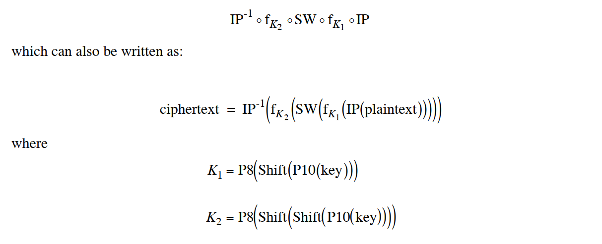

Decryption is also shown in Figure G.1 and is essentially the reverse of encryption:

  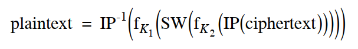

We now examine the elements of S-DES in more detail.

## G.2 S-DES KEY GENERATION

S-DES depends on the use of a 10-bit key shared between sender and receiver. From this key, two 8-bit subkeys are produced for use in particular stages of the encryption and decryption algorithm. Figure G.2 depicts the stages followed to produce the subkeys.

First, permute the key in the following fashion. Let the 10-bit key be designated as (k1, k2, k3, k4, k5, k6, k7, k8, k9, k10). Then the permutation P10 is defined as:

__P10(k1, k2, k3, k4, k5, k6, k7, k8, k9, k10) = (k3, k5, k2, k7, k4, k10, k1, k9, k8, k6)__

P10 can be concisely defined by the display:

  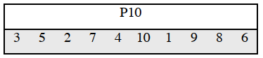

This table is read from left to right; each position in the table gives the identity of the input bit that produces the output bit in that position. So the first output bit is bit 3 of the input; the second output bit is bit 5 of the input, and so on. For example, the key (1010000010) is permuted to (1000001100). Next, perform a circular left shift (LS-1), or rotation, separately on the first five bits and the second five bits. In our example, the result is (00001 11000).

Next we apply P8, which picks out and permutes 8 of the 10 bits according to the following rule:

  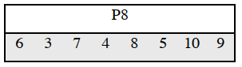

The result is subkey 1 (K1). In our example, this yields (10100100)

We then go back to the pair of 5-bit strings produced by the two LS-1 functions and perform a circular left shift of 2 bit positions on each string. In our example, the value (0000111000) becomes (00100 00011). Finally, P8 is applied again to produce K2. In our example, the result is (01000011).

## G.3 S-DES ENCRYPTION

Figure G.3 shows the S-DES encryption algorithm in greater detail. As was mentioned, encryption involves the sequential application of five functions. We examine each of these.

### Initial and Final Permutations

The input to the algorithm is an 8-bit block of plaintext, which we first permute using the IP function:

  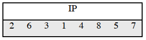

This retains all 8 bits of the plaintext but mixes them up. At the end of the algorithm, the inverse permutation is used:

  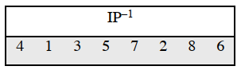

It is easy to show by example that the second permutation is indeed the reverse of the first; that is, IP-1(IP(X)) = X.

### The Function fk

The most complex component of S-DES is the function fK, which consists of a combination of permutation and substitution functions. The functions can be expressed as follows. Let L and R be the leftmost 4 bits and rightmost 4 bits of the 8-bit input to fK, and let F be a mapping (not necessarily one to one) from 4-bit strings to 4-bit strings. Then we let __fK (L, R) = (L + F(R, SK), R) where SK is a subkey and '+' is the bit-by-bit exclusive-OR function__. For example, suppose the output of the IP stage in Figure G.3 is (10111101) and F(1101, SK) = (1110) for some key SK.
Then fK(10111101) = (01011101) because (1011) + (1110) = (0101) 

We now describe the mapping F. The input is a 4-bit number (n1n2n3n4). The first operation is an expansion/permutation operation:

  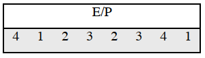

  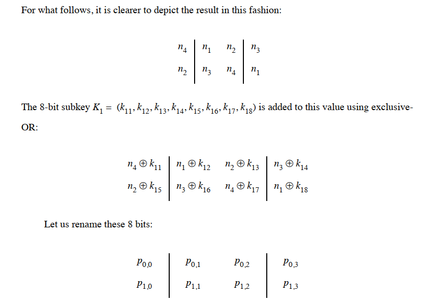

The first 4 bits (first row of the preceding matrix) are fed into the S-box S0 to produce a 2- bit output, and the remaining 4 bits (second row) are fed into S1 to produce another 2-bit output.

These two boxes are defined as follows:

  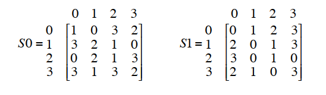

The S-boxes operate as follows. The first and fourth input bits are treated as a 2-bit number that specify a row of the S-box, and the second and third input bits specify a column of the Sbox. The entry in that row and column, in base 2, is the 2-bit output. For example, if (p0,0p0,3) = (00) a(p0,1p0,2) = (10), then the output is from row 0, column 2 of S0, which is 3, or (11) in binary. Similarly, (p1,0p1,3) and (p1,1p1,2) are used to index into a row and column of S1 to produce an additional 2 bits.
Next, the 4 bits produced by S0 and S1 undergo a further permutation as follows:

  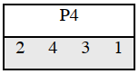

The output of P4 is the output of the function F.

### The Switch Function

The function fK only alters the leftmost 4 bits of the input. The switch function (SW) interchanges the left and right 4 bits so that the second instance of fK operates on a different 4 bits. In this second instance, the E/P, S0, S1, and P4 functions are the same. The key input is K2.

  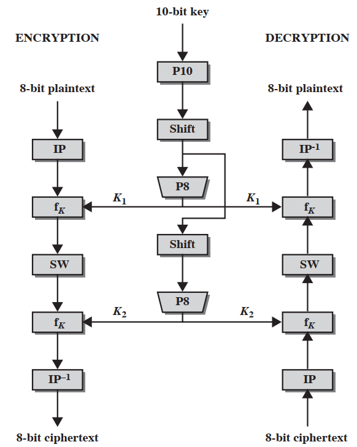
  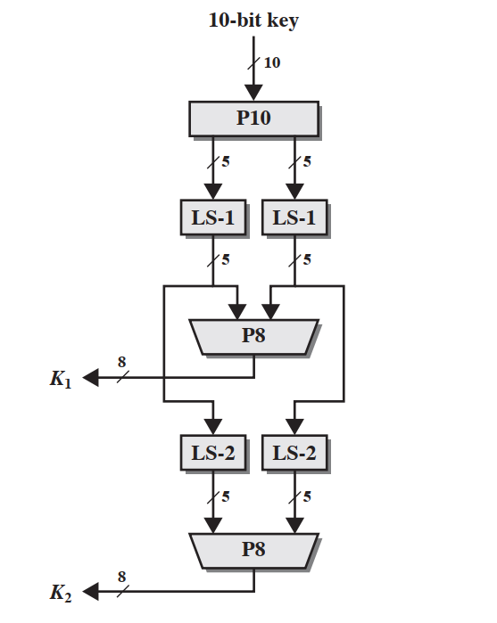
  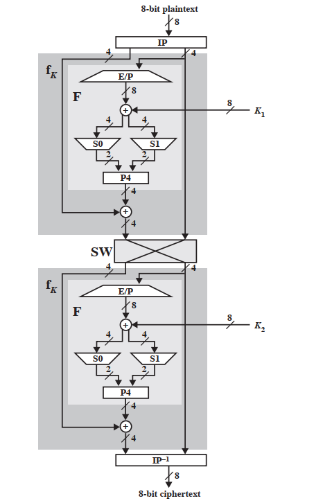

